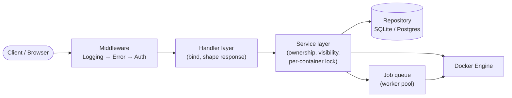
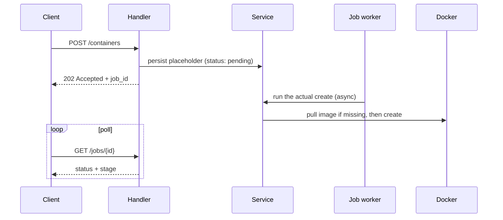

# conTogether

## What is it

A container-management platform: every user gets their own Docker
containers (create, start, stop, delete), an interactive terminal into
them, live log streaming, and a private/public file upload area, all
behind a REST API, with a React dashboard on top.

- **`container-api/`**: the Go backend (everything below is about
  this).
- **`web/`**: the React dashboard. Not a separate deployable:
  `container-api` embeds the built frontend into its own binary
  (`internal/webui`), so in production it's one process, one port (see
  "How it works" below for its structure).

## How to build

Requirements:

- **Go 1.26.3+**, `go.mod`'s minimum. `GOTOOLCHAIN=auto`, the default,
  fetches it automatically if your installed Go is older.
- **A running Docker daemon**, only needed to actually
  create/start/stop/delete containers.
- **Node.js**, only if you want the real embedded frontend instead of
  the checked-in placeholder page.

```bash
go mod download
```

Three ways to run it:

**Docker Compose** (simplest):

```bash
docker compose up --build
# → http://localhost:8080
```

To use Postgres instead of the SQLite default:

```bash
DB_DRIVER=postgres docker compose --profile postgres up --build
```

**Single Go binary:**

```bash
cd container-api && make frontend && go run ./cmd/server
```

**Two dev servers** (frontend hot-reload):

```bash
# terminal 1
cd container-api && go run ./cmd/server   # :8080

# terminal 2
cd web && npm install && npm run dev      # :5173
```

Every route except `/healthz` and `/swagger/*` needs an `X-API-Key`
header, `dev-key` by default (override with `DEV_API_KEY`). Swagger UI
is at `http://localhost:8080/swagger/index.html` (`make docs` inside
`container-api/` to regenerate after changing a handler's annotations).

## How it works

| Package | Responsibility |
|---|---|
| `cmd/server` | Composition root, the only place every concrete type is named |
| `internal/handler` | HTTP layer: bind/validate, call a service, shape the response |
| `internal/service` | Business logic: ownership checks, visibility, per-container lock |
| `internal/job` | Async job queue + worker pool (create/start/stop/delete run here) |
| `internal/repository` | Persistence, SQLite and Postgres, chosen at runtime |
| `internal/migrations` | Versioned schema migrations, embedded, applied by both repos |
| `internal/container` | Docker Engine SDK wrapper |
| `internal/upload` | Per-owner file upload validation + storage |
| `internal/applog` | container-api's own small, dependency-free operational logger |
| `internal/middleware` | Auth, request logging, panic recovery + error → status mapping |
| `internal/domain` | Shared data types (Container, Job, Upload, ...), no behavior |
| `internal/wsstream` | WebSocket transport for log tails and the interactive terminal |
| `internal/webui` | Embeds the built frontend (`../web`), serves it with SPA fallback |



Every dependency is an interface **owned by the package that uses it**,
not the package that implements it: `service` never imports
`repository` or `container`. Everything is wired together exactly once,
in `cmd/server/main.go`. That's what makes the database backend a
runtime choice (`DB_DRIVER=sqlite|postgres`) instead of a compile-time
one, and what makes every package testable against a hand-written fake
instead of a real database or Docker daemon.

**Create/start/stop/delete are all asynchronous.** Docker calls (especially
pulling an image that isn't cached yet) can be slow, so none of them block
the HTTP request. Each returns `202` with a job ID immediately, and the
actual work happens on a worker pool:



A few more things worth knowing:

- **Visibility is a read grant, never a control grant.** `public` lets
  anyone read/list/stream a container's logs; starting, stopping,
  deleting, or getting a shell into it always stays owner-only,
  regardless of visibility.
- **A per-container lock** (one `sync.Mutex` per ID) serializes
  start/stop/delete/visibility-change on the same container, so a start
  and a delete racing each other can't both hit Docker at once.
- **container-api's own operational log is readable over two
  transports, both reading the same data conTogether already has.**
  REST (`GET`/`DELETE /logs`) and WebSocket (`/ws/logs`) call the
  exact same `applog.Manager` methods, so it's a difference in wire
  protocol for reading, not a way to accept logs pushed in from some
  outside service.
- **A managed container's own log, and the interactive terminal into
  it, are both WebSocket-only.** Each needs either a live push (the
  log tail) or a raw, bidirectional byte stream (the terminal), not
  just periodic reads, so there's no REST equivalent for either.

Full diagrams (component map, request lifecycle, the create flow above
in more detail, concurrency control, graceful shutdown) are in
[`docs/diagrams/`](docs/diagrams/): PlantUML, view with
[plantuml.com](https://plantuml.com) or an editor extension.

**Frontend (`web/`)**:

| Directory | Contents |
|---|---|
| `src/api/` | Fetch wrapper + one module per resource (containers, logs, uploads) |
| `src/context/` | API key state, shared across the app via React context |
| `src/hooks/` | `useApiKey`, and the job-status poll loop (`waitForJob`) |
| `src/components/` | Layout (nav + API key input), `StatusBadge` |
| `src/pages/` | One page per route |

A routing gotcha worth knowing: client-side routes must not exactly
match a real `container-api` REST path (see `web/src/App.tsx`). The
router does exact-path matching, so a same-named frontend route would
always hit the real API handler instead of ever reaching the SPA
fallback. That's why the pages are at `/upload` and `/app-logs`, not
`/uploads` or `/logs` (those are real API endpoints).
`vite.config.ts`'s dev-only proxy has the equivalent problem in the
other direction (it matches by *prefix*, not exact path) and works
around it with an `Accept: text/html` bypass; see the comment there.

## How to test

```bash
go test ./... -race
```

- `internal/container`'s tests need a **real** Docker daemon and skip
  if none is reachable (they prove things like "does a duplicate name
  really 409" and "does a container with no command really exit on its
  own" against the real thing, not a fake that assumes the answer).
- `internal/repository`'s Postgres tests skip unless `TEST_POSTGRES_DSN`
  points at a reachable server.
- `internal/handler` wires the real HTTP router and the real job system
  against fakes only at the repository/Docker boundary: a genuine
  submit → worker → poll round trip, not a synthetic stand-in.
- Everything else runs against hand-written fakes.

## Reference

### Configuration

| Env var | Default | Meaning |
|---|---|---|
| `SERVER_PORT` | `8080` | HTTP listen port |
| `DEV_API_KEY` | `dev-key` | Seeded API key → `dev-user` owner |
| `LOG_FILE_PATH` | `container-api.log` | JSON-lines application log |
| `DB_DRIVER` | `sqlite` | `sqlite` or `postgres` |
| `DB_PATH` | `container-api.db` | SQLite file (when `DB_DRIVER=sqlite`) |
| `DATABASE_URL` | *(none)* | Postgres DSN, **required** when `DB_DRIVER=postgres` |
| `UPLOADS_DIR` | `uploads` | Root directory for per-owner uploads |
| `JOB_WORKERS` | `4` | Concurrent async-job worker count |
| `JOB_QUEUE_SIZE` | `100` | Pending-job queue size before `Submit` returns 503 |
| `SHUTDOWN_TIMEOUT` | `10s` | Bounds both HTTP graceful shutdown and job draining |

### Endpoints

| Method | Path | Notes |
|---|---|---|
| GET | `/healthz` | No auth |
| POST | `/containers` | Async, 202 + job ID |
| GET | `/containers` | List what the owner can see (own + everyone's public) |
| GET | `/containers/{id}` | Get |
| PUT | `/containers/{id}/visibility` | Owner-only |
| POST | `/containers/{id}/start` \| `/stop` | Async, 202 + job ID |
| DELETE | `/containers/{id}` | Async, 202 + job ID |
| WS | `/ws/containers/{id}/logs` | Live tail of the container's stdout/stderr |
| WS | `/ws/containers/{id}/exec` | Interactive terminal (owner-only) |
| GET | `/jobs/{jobId}` | Poll job `status` (+ `stage` for create jobs) |
| POST | `/uploads` | Multipart upload, into a per-owner folder |
| GET | `/uploads` \| `/uploads/{id}` | List / download |
| PUT | `/uploads/{id}/visibility` | Owner-only |
| GET`/DELETE` | `/logs` | container-api's own operational log |
| WS | `/ws/logs` | Live tail of the same |

## Known limitations

- **Auth is one seeded key, not self-service.** `DEV_API_KEY` seeds the
  only key that exists at boot (hashed, DB-backed:
  `internal/repository.APIKeyRepo`); there's no endpoint to issue more.
- **Job status is in-memory only** (`job.MemoryStore`). A restart loses
  a job's tracked status, though the underlying Docker operation may
  have already finished.
- **Single-instance.** The per-container lock and job queue are
  in-process; running multiple API instances would need a distributed
  lock/queue instead.
- **Uploads only accept text (CSV/JSON/source) and PNG/JPEG/GIF**,
  sniffed by content; anything else is rejected.
- **Migrations only run forward automatically.** `.down.sql` files exist
  and are tested, but rolling back means running `golang-migrate`'s own
  CLI directly.
